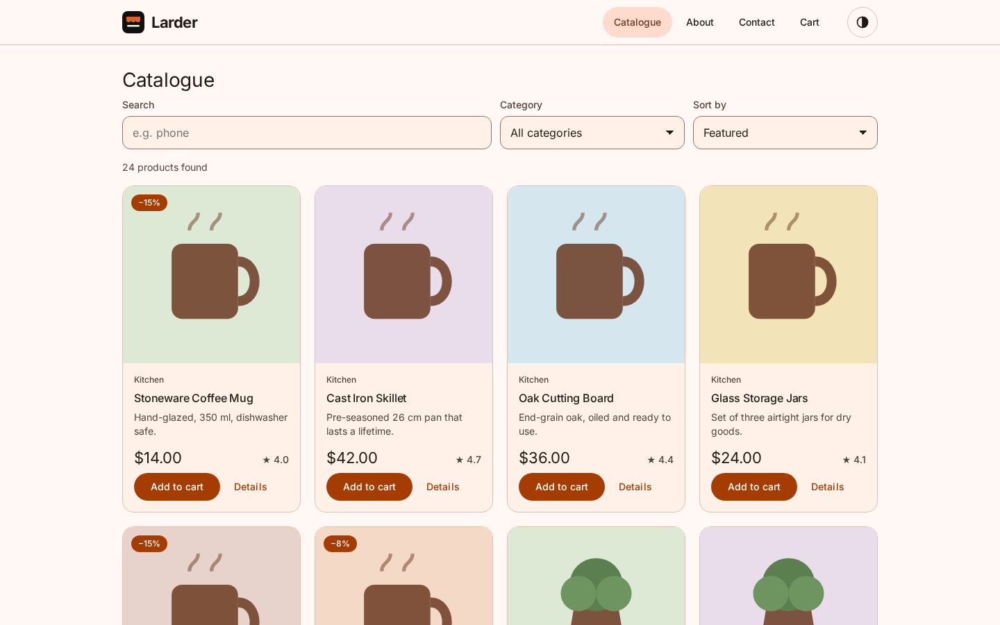
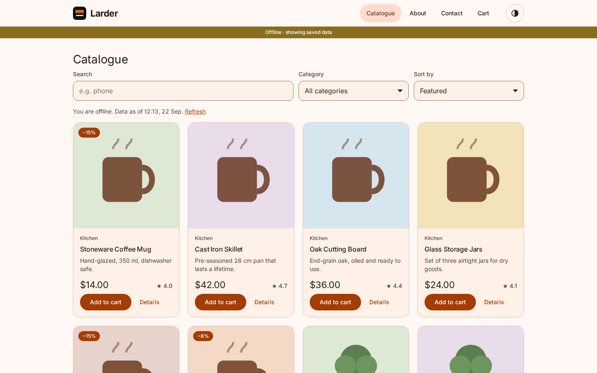

# Larder

A product catalogue that keeps working offline, built with Angular 22.

Browse the catalogue, search it, open a product and fill a cart — then lose the connection and keep going. Pages you have seen are kept on the device, changes to the cart are queued and delivered when the network comes back, and the whole site is prerendered to static HTML, so the first screen arrives as content rather than as an empty page waiting for JavaScript.

**[Open the live demo](https://stiutin.github.io/larder/)**

<p align="center">
  
  
</p>

## Features

- Catalogue with search, category filter, sorting and paging, all kept in the URL
- One prerendered page per product, with its own title, description and Open Graph image
- Cart with quantities, stock limits, discounts, and prices locked when an item is added
- Works offline: every page you have opened is stored in IndexedDB and shown with the time it was saved
- Cart changes and contact messages go through a durable outbox and are sent when the connection returns
- Background Sync in browsers that support it, a retry on reconnect in those that do not
- Price check after reconnecting, with the choice to accept a new price or remove the item
- Text typed before the page finishes loading is never lost
- Installable as a Progressive Web App, with an in-app prompt when a new version is ready
- Light, dark and system themes, with no flash of the wrong theme on load
- Keyboard support, a skip link, visible focus, reduced motion respected, WCAG AA contrast in both themes
- About and Contact pages; the contact form validates as you go and queues messages offline
- Deployed to GitHub Pages from CI after every green push

## Tech stack

[Angular 22](https://angular.dev/) (standalone, zoneless, signals), [NgRx SignalStore](https://ngrx.io/guide/signals), [Angular Material 3](https://material.angular.dev/), RxJS, [idb](https://github.com/jakearchibald/idb) for IndexedDB, [valibot](https://valibot.dev/) for runtime validation, the Angular Service Worker, SCSS.
Tested with [Vitest](https://vitest.dev/), [Testing Library](https://testing-library.com/docs/angular-testing-library/intro/), [Playwright](https://playwright.dev/), axe-core and Lighthouse CI.
Product data comes from [dummyjson](https://dummyjson.com/).

## How it works

### Rendering

The site is hosted on GitHub Pages, which only serves files, so every page is rendered to HTML at build time: the catalogue, About, Contact, the cart shell, and one page for each product, whose ids are fetched from the API during the build. Anything else falls through to `404.html`, which is the client shell — the router then shows the not-found page, or a product added after the last build.

A prerendered page carries the state it was rendered with. The catalogue store starts from that snapshot instead of an empty state, so hydration picks up exactly where the HTML left off, without a skeleton flashing over content that is already on screen. It then refreshes the snapshot quietly in the background, because build-time data should not linger until the next deploy.

The cart is the one page the build cannot know. It is prerendered as a loading shell, which is also what the first client render shows, so the markup matches and the real contents appear once the device storage has been read.

### State

All state lives in two NgRx SignalStores.

```
CatalogStore   entities, current page, query, status, categories
  ├── withEntities       products accumulate across pages
  ├── withComputed       current page, page count, active filters
  ├── rxMethod           one request stream with switchMap
  ├── signalMethod       bound to the URL: every change requests a page
  └── withHooks          start from the prerendered snapshot, refresh it

CartStore      items, conflicts, hydration flag
  ├── withComputed       totals, count, product ids
  ├── rxMethod           price reconciliation against the API
  └── withHooks          read from IndexedDB, write back, stage sync requests
```

The URL is the single source of truth for the catalogue. Query parameters arrive in the page component as signal inputs, are parsed into a query — any garbage in the address bar becomes a valid query rather than a broken page — and handed to the store. Because requests go through `switchMap`, a newer query always cancels an older one, so fast typing can never leave the results of an earlier search on screen.

`CatalogStore` is provided on the lazy catalogue route, so it — and the whole data layer behind it — stays out of the initial bundle.

### Offline data

Data goes through a repository that implements stale-while-revalidate over IndexedDB:

| Situation | What the user sees |
| --- | --- |
| First visit | the page, then it is stored |
| Repeat visit | the stored page instantly, then fresh data replaces it |
| Offline, page seen before | the stored page and "Data as of 14:32" |
| Offline, page never seen | a clear message instead of an error |

The order is guaranteed by `concat`: the cache is read first and the network second, so stale data can never overwrite fresh data even when the disk answers slower than the server. Pages store only product ids; products are stored once, by id, however many pages they appear on.

API responses are cached by the application, not by the Service Worker. If the worker answered from its own cache, the app could not tell cached data from fresh, and the timestamp would be a guess.

Every response is validated against a valibot schema. TypeScript types disappear at runtime, and a change in the API's shape becomes a visible error instead of a crash somewhere in a template.

### The outbox

The cart lives on the device. Every change is written to IndexedDB at once — both the cart itself and a request for the server — and only the network call is debounced, so five quick clicks on "+" produce one request, and a reload in the middle loses nothing.

Requests are kept whole (URL, method, body), which means two parties can replay them: the application, and the Service Worker through Background Sync, even after the tab has been closed. Flushes are serialised, and an entry that was replaced while it was in flight is neither deleted nor overwritten, so a newer cart state can never be lost to an older one finishing late. Network errors, server errors, timeouts and rate limits are retried; a request the server refuses outright (a 400 or 422) is dropped, because sending it again cannot succeed. An emptied cart removes its pending snapshot rather than posting an empty cart, which the demo API rejects.

When the connection returns, the cart checks its locked prices against the API. A changed price or a product that disappeared becomes a conflict the user resolves; a check that fails is not treated as a change.

### Service Worker

`sw-sync.js` imports the standard Angular worker and adds one handler: on a `sync` event it replays the outbox from IndexedDB and tells open tabs it has done so. The worker caches the app shell, static files and product images. Navigations go to the network first and fall back to the cached shell offline, so returning visitors get prerendered HTML rather than a client-rendered page that shifts as it fills in.

### Forms and hydration

Anything typed before hydration has to survive it. Property bindings are re-applied while the page hydrates and would silently wipe a field, so the catalogue filters render their values as attributes and receive later URL changes through an effect. The contact form uses reactive forms, which always write their values during hydration, so its fields stay read-only until the page is interactive.

### Theming and accessibility

The Material 3 palette is generated from three brand colours, and colours are defined with CSS `light-dark()`, so the dark theme is `color-scheme: dark` rather than a second stylesheet. A small inline script applies a saved theme before the first frame.

A unit test checks the contrast of every text and background pair in both themes against WCAG AA. axe-core runs on every prerendered page and again in a real browser in both themes.

## Testing

| Layer | Tool | What it covers |
| --- | --- | --- |
| Unit and component | Vitest, Testing Library, jsdom | logic, stores, data layer, outbox, components — 91 tests |
| Static site | `node:test`, axe-core | the prerendered pages, served exactly like GitHub Pages |
| End-to-end | Playwright | search, cart, offline and contact journeys on desktop and mobile — 23 scenarios |
| Performance | Lighthouse CI | performance, accessibility, best practices, SEO |

Unit tests run zoneless, like the app, against a real IndexedDB API (fake-indexeddb) rather than hand-written mocks, and wait for conditions rather than fixed delays. Coverage is measured across the whole of `src/app`, with thresholds enforced in CI.

The static-site tests and Playwright use a build prerendered against a local mock API, served by a script that behaves like GitHub Pages: `/about` redirects to `/about/`, and unknown paths get `404.html` with a 404 status. Browser requests are answered by the same mock, so the prerendered HTML and the data fetched after hydration always agree.

## Project structure

```
src/
├── app/
│   ├── core/          # errors, HTTP interceptor, IndexedDB, outbox, network status, title strategy
│   ├── features/
│   │   ├── catalog/   # catalogue and product pages, CatalogStore, toolbar, paging
│   │   ├── cart/      # cart page, CartStore, storage, totals
│   │   ├── about/
│   │   └── contact/   # form, contact service
│   ├── shared/        # models, API + cache + repository, product card, layout
│   ├── app.config.ts
│   └── app.routes.server.ts   # what is prerendered
├── sw-sync.js         # Service Worker extension: Background Sync for the outbox
└── styles.scss        # theme, tokens, base styles

e2e/                   # Playwright journeys and accessibility checks
tests/
├── mock-api/          # dummyjson stand-in shared by builds, tests and screenshots
└── static/            # tests for the prerendered site
scripts/               # build for Pages, Pages emulator, screenshots, bundle report

.github/workflows/
└── ci.yml             # lint, tests, e2e, Lighthouse, then deploy to GitHub Pages
```

## Running locally

Requires Node 22.22.3 or newer.

```bash
git clone https://github.com/stiutin/larder.git
cd larder
npm ci
npm start
```

Other scripts:

```bash
npm run build          # production build for GitHub Pages
npm run serve          # serve the build the way GitHub Pages does
npm test               # unit and component tests
npm run test:coverage  # the same, with coverage thresholds
npm run test:static    # tests for the prerendered site
npm run e2e            # Playwright (run `npx playwright install chromium` once)
npm run lighthouse     # Lighthouse CI
npm run screenshots    # regenerate the README screenshots
npm run lint           # ESLint and Stylelint
npm run typecheck      # TypeScript for the app, the specs and the e2e suite
```

The commands that test the built site make a build first when there is none, or when the sources have changed since.

## Deployment

Pushing to the default branch runs formatting, lint, type checks, unit tests, the static-site tests, Playwright and Lighthouse. Only when those pass does the deploy job build the site against the real API and publish it to GitHub Pages.

Because the site is served from a sub-path, the deploy job builds with `--base-href /larder/`, derived from the repository name; for a custom domain, set the repository variable `PAGES_BASE_HREF` to `/`. Before publishing, `npm run check:pages` looks for what breaks silently on a sub-path: links that ignore the base href, a missing `404.html`, no product pages.

To reproduce the deployment locally:

```bash
BASE_HREF=/larder/ npm run build
BASE_HREF=/larder/ npm run serve     # http://localhost:4000/larder/
```

## Roadmap

- [ ] A real backend to replace the read-only demo API — NestJS is the natural fit next to Angular, with Express or Laravel as the lighter and the batteries-included alternatives
- [ ] A monorepo (Nx or Turborepo) with `apps/web`, `apps/api` and shared libraries for models and validation schemas, so the client and the server share one contract
- [ ] Accounts, with a cart that follows the user between devices; the outbox already models the sync
- [ ] Server-side rendering on a Node host once the backend exists, for product pages that are always current
- [ ] Checkout and order history
- [ ] Wishlists and recently viewed products
- [ ] Localisation, starting with Ukrainian
- [ ] Moving focus to the new page's heading after navigation, coordinated with view transitions
- [ ] Error reporting (Sentry or OpenTelemetry) behind the global error handler

## License

Released under the [MIT License](LICENSE).

## Author

**Serge Tiutin** — [github.com/stiutin](https://github.com/stiutin)
